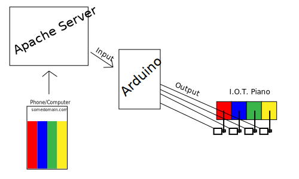

# dragonfire.club : An Internet of Things Piano
An Internet of Things "piano" using solenoids and glasses with varying water levels. 
Originally created for an EE102 project (documented a year later in an effort to clean up my repositories).

## Proposed Design

Initially, a design was proposed involving servos, drumsticks, and a glockenspiel as pictured above. However, this design had the following two problems:
* Fast servos were expensive.
* WiFi modules for the Arduino were expensive.
* No local store in Fairbanks, Alaska could be found selling glockenspiels.

## Revised Design

After some thought and planning, a much more detailed revised design was creating utilizing solenoids and a computer to handle networking. The advantages with this plan were:
* The arduino only had to worry about a simple and easy serial connection to a laptop.
* A much more capable Node.js backend could be used to handle wireless networking.
* Solenoids were much cheaper.
* Commonly available wine glasses filled with water could be used in place of a glockenspiel.
